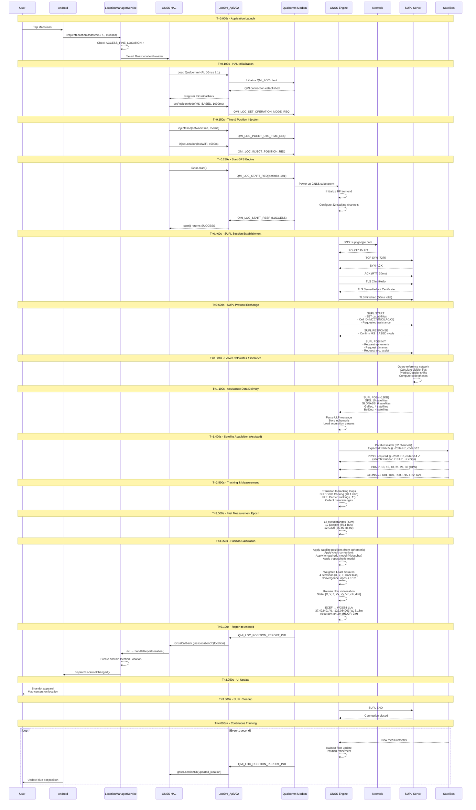

# GNSS-Tracker (PosModeTest)

> A Professional GNSS Testing Tool for Android - Understanding the Complete GPS Acquisition Flow

## Overview

This repository contains **PosModeTest**, a professional GNSS (Global Navigation Satellite System) testing and debugging application originally developed by Sony for internal device testing. The app provides deep visibility into the Android location stack and Qualcomm GNSS hardware.

This document also traces the complete technical flow of GPS location acquisition, demonstrating what happens under the hood when your app requests a location fix.

### Example Parameters
- **Location**: Google HQ (37.422°N, 122.084°W)
- **Device**: Snapdragon 888 (SM8350) with Qualcomm Gen 5 GNSS
- **Network**: 4G LTE with SUPL capability
- **Total Time**: 3.3 seconds to first fix (cold start)

---

## Table of Contents

1. [Android GNSS Architecture](#android-gnss-architecture)
2. [Qualcomm GNSS Hardware Stack](#qualcomm-gnss-hardware-stack)
3. [Complete GPS Acquisition Flow](#complete-gps-acquisition-flow)
4. [Detailed Timeline](#detailed-timeline)
5. [How PosModeTest Monitors This Flow](#how-posmodetest-monitors-this-flow)
6. [Performance Metrics](#performance-metrics)
7. [References](#references)

---

## Android GNSS Architecture

### Complete Software Stack

```
┌─────────────────────────────────────────────────────────────────────────────────┐
│                           APPLICATION LAYER                                      │
├─────────────────────────────────────────────────────────────────────────────────┤
│  ┌─────────────────┐  ┌─────────────────┐  ┌─────────────────────────────────┐  │
│  │  Google Maps    │  │  PosModeTest    │  │  Any Location-Aware App         │  │
│  │                 │  │  (This App)     │  │                                 │  │
│  │  LocationClient │  │  LocationMgr    │  │  FusedLocationProviderClient   │  │
│  └────────┬────────┘  └────────┬────────┘  └────────────────┬────────────────┘  │
│           │                    │                            │                    │
│           └────────────────────┼────────────────────────────┘                    │
│                                │                                                 │
│                                ▼                                                 │
├─────────────────────────────────────────────────────────────────────────────────┤
│                           FRAMEWORK LAYER (Java)                                 │
├─────────────────────────────────────────────────────────────────────────────────┤
│  ┌─────────────────────────────────────────────────────────────────────────┐    │
│  │                     LocationManagerService                               │    │
│  │  ┌─────────────────────────────────────────────────────────────────┐    │    │
│  │  │  • Permission enforcement (ACCESS_FINE_LOCATION)                │    │    │
│  │  │  • Provider selection (GPS, Network, Fused)                     │    │    │
│  │  │  • Location request multiplexing                                │    │    │
│  │  │  • Power management & batching                                  │    │    │
│  │  │  • Geofencing coordination                                      │    │    │
│  │  └─────────────────────────────────────────────────────────────────┘    │    │
│  └─────────────────────────────────────────────────────────────────────────┘    │
│                                │                                                 │
│  ┌─────────────────────────────┼─────────────────────────────────────────────┐  │
│  │                             ▼                                             │  │
│  │  ┌───────────────┐  ┌───────────────┐  ┌───────────────┐                 │  │
│  │  │GnssLocation   │  │NetworkLocation│  │FusedLocation  │                 │  │
│  │  │Provider       │  │Provider       │  │Provider (GMS) │                 │  │
│  │  │               │  │               │  │               │                 │  │
│  │  │ • GNSS HAL    │  │ • Cell towers │  │ • Sensor      │                 │  │
│  │  │   binding     │  │ • WiFi APs    │  │   fusion      │                 │  │
│  │  │ • A-GNSS      │  │ • IP geoloc   │  │ • ML models   │                 │  │
│  │  │ • GNSS status │  │               │  │ • Batching    │                 │  │
│  │  └───────┬───────┘  └───────────────┘  └───────────────┘                 │  │
│  └──────────┼────────────────────────────────────────────────────────────────┘  │
│             │                                                                    │
│             │ JNI (Java Native Interface)                                        │
│             ▼                                                                    │
├─────────────────────────────────────────────────────────────────────────────────┤
│                        NATIVE LAYER (C/C++)                                      │
├─────────────────────────────────────────────────────────────────────────────────┤
│  ┌─────────────────────────────────────────────────────────────────────────┐    │
│  │                     GnssHal.cpp / GnssHalJni.cpp                         │    │
│  │  ┌─────────────────────────────────────────────────────────────────┐    │    │
│  │  │  • Loads vendor GNSS HAL (dlopen)                               │    │    │
│  │  │  • Implements IGnss HIDL/AIDL interface                         │    │    │
│  │  │  • Converts Java ↔ Native data types                            │    │    │
│  │  │  • Manages callbacks to Java layer                              │    │    │
│  │  └─────────────────────────────────────────────────────────────────┘    │    │
│  └─────────────────────────────────────────────────────────────────────────┘    │
│             │                                                                    │
│             │ HIDL / AIDL IPC                                                    │
│             ▼                                                                    │
├─────────────────────────────────────────────────────────────────────────────────┤
│                   HARDWARE ABSTRACTION LAYER (HAL)                               │
├─────────────────────────────────────────────────────────────────────────────────┤
│  ┌─────────────────────────────────────────────────────────────────────────┐    │
│  │              Vendor GNSS HAL (android.hardware.gnss@2.1)                 │    │
│  │  ┌─────────────────────────────────────────────────────────────────┐    │    │
│  │  │  Interfaces:                                                    │    │    │
│  │  │  • IGnss - Main GNSS control                                    │    │    │
│  │  │  • IGnssCallback - Position/status callbacks                    │    │    │
│  │  │  • IGnssMeasurement - Raw measurements                          │    │    │
│  │  │  • IGnssNavigationMessage - Nav data                            │    │    │
│  │  │  • IGnssConfiguration - Chip configuration                      │    │    │
│  │  │  • IGnssDebug - Debug information                               │    │    │
│  │  │  • IGnssBatching - Batched locations                            │    │    │
│  │  │  • IGnssGeofencing - Geofence support                           │    │    │
│  │  │  • IAGnss - Assisted GNSS (SUPL)                                │    │    │
│  │  │  • IAGnssRil - Radio Interface Layer integration                │    │    │
│  │  └─────────────────────────────────────────────────────────────────┘    │    │
│  └─────────────────────────────────────────────────────────────────────────┘    │
│             │                                                                    │
│             │ QMI (Qualcomm MSM Interface) / Vendor Protocol                     │
│             ▼                                                                    │
├─────────────────────────────────────────────────────────────────────────────────┤
│                      VENDOR DAEMON / SERVICE                                     │
├─────────────────────────────────────────────────────────────────────────────────┤
│  ┌─────────────────────────────────────────────────────────────────────────┐    │
│  │                 Qualcomm Location Service (loc_launcher)                 │    │
│  │  ┌─────────────────────────────────────────────────────────────────┐    │    │
│  │  │  Components:                                                    │    │    │
│  │  │  • loc_launcher - Main daemon                                   │    │    │
│  │  │  • lowi-server - WiFi positioning                               │    │    │
│  │  │  • xtra-daemon - XTRA assistance data                           │    │    │
│  │  │  • slim_daemon - Sensor integration                             │    │    │
│  │  │  • garden_app - Test utility                                    │    │    │
│  │  │                                                                 │    │    │
│  │  │  Communication via:                                             │    │    │
│  │  │  • QMI_LOC service (Location)                                   │    │    │
│  │  │  • QMI_NAS service (Network)                                    │    │    │
│  │  │  • Shared memory for measurements                               │    │    │
│  │  └─────────────────────────────────────────────────────────────────┘    │    │
│  └─────────────────────────────────────────────────────────────────────────┘    │
│             │                                                                    │
│             │ QMI Protocol over SMD/GLINK                                        │
│             ▼                                                                    │
├─────────────────────────────────────────────────────────────────────────────────┤
│                           KERNEL LAYER                                           │
├─────────────────────────────────────────────────────────────────────────────────┤
│  ┌─────────────────────────────────────────────────────────────────────────┐    │
│  │                     Linux Kernel Drivers                                 │    │
│  │  ┌─────────────────────────────────────────────────────────────────┐    │    │
│  │  │  • /dev/smd* - Shared Memory Driver (legacy)                    │    │    │
│  │  │  • /dev/glink* - Generic Link (modern)                          │    │    │
│  │  │  • /dev/subsys_modem - Modem subsystem                          │    │    │
│  │  │  • qmi_wwan - QMI over WWAN                                     │    │    │
│  │  │  • msm_geni_serial - UART for debug                             │    │    │
│  │  └─────────────────────────────────────────────────────────────────┘    │    │
│  └─────────────────────────────────────────────────────────────────────────┘    │
│             │                                                                    │
│             │ Hardware Mailbox / Shared Memory                                   │
│             ▼                                                                    │
├─────────────────────────────────────────────────────────────────────────────────┤
│                          HARDWARE LAYER                                          │
├─────────────────────────────────────────────────────────────────────────────────┤
│  ┌─────────────────────────────────────────────────────────────────────────┐    │
│  │                   Qualcomm Modem Subsystem                               │    │
│  │  ┌─────────────────────────────────────────────────────────────────┐    │    │
│  │  │                    GNSS Engine (Hexagon DSP)                     │    │    │
│  │  │  ┌───────────────────────────────────────────────────────────┐  │    │    │
│  │  │  │  • RF Frontend (GPS L1/L5, GLONASS, Galileo, BeiDou)     │  │    │    │
│  │  │  │  • Baseband processor                                     │  │    │    │
│  │  │  │  • Correlators (32+ channels)                             │  │    │    │
│  │  │  │  • Navigation processor                                   │  │    │    │
│  │  │  │  • PVT (Position/Velocity/Time) engine                    │  │    │    │
│  │  │  └───────────────────────────────────────────────────────────┘  │    │    │
│  │  └─────────────────────────────────────────────────────────────────┘    │    │
│  └─────────────────────────────────────────────────────────────────────────┘    │
└─────────────────────────────────────────────────────────────────────────────────┘
```

### Key Android Classes

| Class | Package | Purpose |
|-------|---------|---------|
| `LocationManager` | `android.location` | App-facing API for location requests |
| `LocationManagerService` | `com.android.server.location` | System service managing all providers |
| `GnssLocationProvider` | `com.android.server.location.gnss` | GPS/GNSS provider implementation |
| `GnssNative` | `com.android.server.location.gnss` | JNI bridge to native HAL |
| `GnssConfiguration` | `com.android.server.location.gnss` | HAL configuration manager |
| `GnssStatusListenerHelper` | `com.android.server.location.gnss` | Satellite status distribution |
| `GnssMeasurementsProvider` | `com.android.server.location.gnss` | Raw measurements manager |

---

## Qualcomm GNSS Hardware Stack

### Snapdragon GNSS Generations

| Generation | Snapdragon Series | Constellations | Features |
|------------|-------------------|----------------|----------|
| Gen 1 | 800 series (early) | GPS, GLONASS | Basic A-GPS |
| Gen 2 | 810, 820 | +Galileo, BeiDou | Multi-constellation |
| Gen 3 | 835, 845 | +QZSS, NavIC | Dual-frequency L1+L5 |
| Gen 4 | 855, 865 | All 7 systems | Lane-level accuracy |
| **Gen 5** | **888, 8 Gen 1** | All 7 systems | **cm-level (PPP)** |

### Qualcomm Location Stack Components

```
┌─────────────────────────────────────────────────────────────────────────────┐
│                    QUALCOMM GNSS SOFTWARE STACK                              │
├─────────────────────────────────────────────────────────────────────────────┤
│                                                                              │
│  ┌────────────────────────────────────────────────────────────────────────┐ │
│  │                     Application Processor (AP)                         │ │
│  │  ┌──────────────────┐  ┌──────────────────┐  ┌──────────────────────┐ │ │
│  │  │  GNSS HAL        │  │  LocSvc_ApiV02   │  │  izat.conf           │ │ │
│  │  │  (HAL Interface) │  │  (API Client)    │  │  (Configuration)     │ │ │
│  │  │                  │  │                  │  │                      │ │ │
│  │  │  • IGnss         │  │  • QMI Client    │  │  • SUPL settings     │ │ │
│  │  │  • IGnssCb       │  │  • Message enc   │  │  • XTRA settings     │ │ │
│  │  │  • IGnssMeas     │  │  • Position req  │  │  • Constellation     │ │ │
│  │  └────────┬─────────┘  └────────┬─────────┘  │    enable/disable    │ │ │
│  │           │                     │            │  • NI settings       │ │ │
│  │           │                     │            └──────────────────────┘ │ │
│  │           └──────────┬──────────┘                                     │ │
│  │                      │                                                │ │
│  │                      ▼                                                │ │
│  │  ┌────────────────────────────────────────────────────────────────┐  │ │
│  │  │                    loc_launcher (Daemon)                        │  │ │
│  │  │  ┌────────────────────────────────────────────────────────┐    │  │ │
│  │  │  │  • Spawns location processes                           │    │  │ │
│  │  │  │  • Manages QMI connections                             │    │  │ │
│  │  │  │  • Handles modem SSR (Subsystem Restart)               │    │  │ │
│  │  │  │  • Configuration parsing                               │    │  │ │
│  │  │  └────────────────────────────────────────────────────────┘    │  │ │
│  │  │                      │                                          │  │ │
│  │  │      ┌───────────────┼───────────────┬──────────────┐          │  │ │
│  │  │      ▼               ▼               ▼              ▼          │  │ │
│  │  │  ┌────────┐     ┌────────┐     ┌────────┐    ┌──────────┐     │  │ │
│  │  │  │ xtra-  │     │ lowi-  │     │ slim_  │    │ geofence │     │  │ │
│  │  │  │ daemon │     │ server │     │ daemon │    │ _service │     │  │ │
│  │  │  │        │     │        │     │        │    │          │     │  │ │
│  │  │  │ XTRA   │     │ WiFi   │     │ Sensor │    │ HW       │     │  │ │
│  │  │  │ assist │     │ RTT    │     │ fusion │    │ geofence │     │  │ │
│  │  │  └────────┘     └────────┘     └────────┘    └──────────┘     │  │ │
│  │  └────────────────────────────────────────────────────────────────┘  │ │
│  └──────────────────────────────────────────────────────────────────────┘ │
│                                     │                                      │
│                                     │ QMI over SMD/GLINK                   │
│                                     ▼                                      │
│  ┌────────────────────────────────────────────────────────────────────────┐ │
│  │                     Modem Processor (Hexagon DSP)                      │ │
│  │  ┌──────────────────────────────────────────────────────────────────┐ │ │
│  │  │                    QMI_LOC Service                                │ │ │
│  │  │  ┌────────────────────────────────────────────────────────────┐  │ │ │
│  │  │  │  Messages:                                                 │  │ │ │
│  │  │  │  • QMI_LOC_START_REQ/RESP - Start positioning              │  │ │ │
│  │  │  │  • QMI_LOC_STOP_REQ/RESP - Stop positioning                │  │ │ │
│  │  │  │  • QMI_LOC_POSITION_REPORT_IND - Position fix              │  │ │ │
│  │  │  │  • QMI_LOC_SV_INFO_IND - Satellite status                  │  │ │ │
│  │  │  │  • QMI_LOC_GNSS_MEASUREMENT_REPORT_IND - Raw data          │  │ │ │
│  │  │  │  • QMI_LOC_INJECT_POSITION_REQ - Coarse position           │  │ │ │
│  │  │  │  • QMI_LOC_INJECT_UTC_TIME_REQ - Time injection            │  │ │ │
│  │  │  │  • QMI_LOC_DELETE_ASSIST_DATA_REQ - Clear aiding           │  │ │ │
│  │  │  │  • QMI_LOC_SET_OPERATION_MODE_REQ - MS-A/MS-B mode         │  │ │ │
│  │  │  └────────────────────────────────────────────────────────────┘  │ │ │
│  │  └──────────────────────────────────────────────────────────────────┘ │ │
│  │                                     │                                  │ │
│  │  ┌──────────────────────────────────┼────────────────────────────────┐│ │
│  │  │                    GNSS Engine   │                                ││ │
│  │  │  ┌───────────────────────────────┼─────────────────────────────┐  ││ │
│  │  │  │                               ▼                             │  ││ │
│  │  │  │  ┌──────────────┐  ┌──────────────────┐  ┌──────────────┐  │  ││ │
│  │  │  │  │ Acquisition  │  │ Tracking Loops   │  │ Navigation   │  │  ││ │
│  │  │  │  │              │  │                  │  │ Processor    │  │  ││ │
│  │  │  │  │ • FFT search │  │ • DLL (code)     │  │              │  │  ││ │
│  │  │  │  │ • Parallel   │  │ • PLL (carrier)  │  │ • Pseudorange│  │  ││ │
│  │  │  │  │   correlator │  │ • FLL (freq)     │  │   calculation│  │  ││ │
│  │  │  │  │ • 32 channels│  │ • C/N0 estimate  │  │ • Least sq   │  │  ││ │
│  │  │  │  └──────────────┘  └──────────────────┘  │ • Kalman     │  │  ││ │
│  │  │  │                                          │ • ECEF→LLA   │  │  ││ │
│  │  │  │                                          └──────────────┘  │  ││ │
│  │  │  └─────────────────────────────────────────────────────────────┘  ││ │
│  │  └───────────────────────────────────────────────────────────────────┘│ │
│  │                                     │                                  │ │
│  │  ┌──────────────────────────────────┼────────────────────────────────┐│ │
│  │  │                    RF Frontend   │                                ││ │
│  │  │  ┌───────────────────────────────┼─────────────────────────────┐  ││ │
│  │  │  │                               ▼                             │  ││ │
│  │  │  │  ┌─────────┐  ┌─────────┐  ┌─────────┐  ┌─────────────────┐│  ││ │
│  │  │  │  │ LNA     │→ │ Mixer   │→ │ ADC     │→ │ Digital Filter  ││  ││ │
│  │  │  │  │         │  │         │  │         │  │                 ││  ││ │
│  │  │  │  │ Gain:   │  │ L1:     │  │ 2-bit   │  │ • Decimation    ││  ││ │
│  │  │  │  │ 20 dB   │  │ 1575.42 │  │ @16 MHz │  │ • Correlation   ││  ││ │
│  │  │  │  │         │  │ L5:     │  │         │  │   ready samples ││  ││ │
│  │  │  │  │         │  │ 1176.45 │  │         │  │                 ││  ││ │
│  │  │  │  └─────────┘  └─────────┘  └─────────┘  └─────────────────┘│  ││ │
│  │  │  └─────────────────────────────────────────────────────────────┘  ││ │
│  │  └───────────────────────────────────────────────────────────────────┘│ │
│  └──────────────────────────────────────────────────────────────────────────┘ │
│                                     ▲                                      │
│                                     │ RF Signal                            │
│                                     │                                      │
└─────────────────────────────────────┼──────────────────────────────────────┘
                                      │
                            ┌─────────┴─────────┐
                            │   GNSS Antenna    │
                            │   (L1/L5 patch)   │
                            └───────────────────┘
                                      ▲
                                      │
                    ┌─────────────────┼─────────────────┐
                    │                 │                 │
                    ▼                 ▼                 ▼
            ┌─────────────┐   ┌─────────────┐   ┌─────────────┐
            │    GPS      │   │  GLONASS    │   │  Galileo    │
            │  31 sats    │   │  24 sats    │   │  30 sats    │
            └─────────────┘   └─────────────┘   └─────────────┘
```

### QMI (Qualcomm MSM Interface) Messages

| Message ID | Name | Direction | Purpose |
|------------|------|-----------|---------|
| 0x0022 | `QMI_LOC_START` | AP → Modem | Start GNSS session |
| 0x0023 | `QMI_LOC_STOP` | AP → Modem | Stop GNSS session |
| 0x0024 | `QMI_LOC_POSITION_REPORT_IND` | Modem → AP | Position fix |
| 0x0025 | `QMI_LOC_SV_INFO_IND` | Modem → AP | Satellite status |
| 0x0028 | `QMI_LOC_INJECT_UTC_TIME` | AP → Modem | Time aiding |
| 0x0029 | `QMI_LOC_INJECT_POSITION` | AP → Modem | Position aiding |
| 0x002C | `QMI_LOC_DELETE_ASSIST_DATA` | AP → Modem | Clear ephemeris/almanac |
| 0x0044 | `QMI_LOC_GNSS_MEASUREMENT_REPORT_IND` | Modem → AP | Raw measurements |
| 0x0051 | `QMI_LOC_SV_POLYNOMIAL_REPORT_IND` | Modem → AP | SV polynomial data |

---

## Complete GPS Acquisition Flow

### Sequence Diagram



---

## Detailed Timeline

### Phase 1: Application Launch (T=0.000s to T=0.250s)

| Time | Component | Event | Technical Details |
|------|-----------|-------|-------------------|
| T=0.000s | App | User taps Maps icon | Android starts Activity |
| T=0.020s | Framework | LocationManager.requestLocationUpdates() | Criteria: GPS, 1000ms interval |
| T=0.030s | Framework | Permission check | ACCESS_FINE_LOCATION granted ✓ |
| T=0.050s | Framework | Provider selection | GnssLocationProvider selected |
| T=0.080s | Framework | JNI call | GnssNative.startSvStatus() |
| T=0.100s | HAL | Load vendor HAL | dlopen("android.hardware.gnss@2.1-impl.so") |
| T=0.120s | HAL | QMI client init | LocSvc_ApiV02 connects to QMI_LOC |
| T=0.150s | HAL | Position mode | setPositionMode(MS_BASED, PERIODIC, 1000) |
| T=0.180s | HAL | Time injection | injectTime(NTP_time, uncertainty=50ms) |
| T=0.200s | HAL | Position injection | injectLocation(WiFi_pos, uncertainty=500m) |
| T=0.220s | HAL | Start request | IGnss.start() |
| T=0.230s | Modem | QMI message | QMI_LOC_START_REQ (session_id=1) |
| T=0.250s | Engine | Power up | RF frontend ON, PLL locked |

### Phase 2: SUPL Assistance (T=0.300s to T=1.100s)

| Time | Component | Event | Technical Details |
|------|-----------|-------|-------------------|
| T=0.300s | Engine | Initialize | 32 correlator channels ready |
| T=0.400s | Engine | DNS lookup | supl.google.com → 172.217.15.174 |
| T=0.420s | Engine | TCP connect | SYN → :7275 |
| T=0.440s | SUPL | TCP accept | SYN-ACK (RTT: 20ms) |
| T=0.450s | Engine | TCP established | ACK sent |
| T=0.460s | Engine | TLS handshake | ClientHello (TLS 1.2) |
| T=0.480s | SUPL | TLS response | ServerHello + Certificate |
| T=0.500s | Engine | TLS complete | Session key established |
| T=0.600s | Engine | SUPL START | Capabilities, Cell ID (310-260-1234-5678) |
| T=0.650s | SUPL | SUPL RESPONSE | MS_BASED confirmed |
| T=0.700s | Engine | SUPL POS INIT | Request: EPH, ALM, ACQ_ASSIST, TIME |
| T=0.800s | SUPL | Generate assist | Query reference stations |
| T=1.000s | SUPL | SUPL POS ready | 24 satellite ephemerides |
| T=1.100s | Engine | Receive assist | 12KB data parsed |

### Phase 3: Satellite Acquisition (T=1.400s to T=3.100s)

| Time | Component | Event | Technical Details |
|------|-----------|-------|-------------------|
| T=1.400s | Engine | Start acquisition | 32-channel parallel search |
| T=1.450s | Engine | PRN 5 search | Expected: -2534 Hz Doppler, code 512 |
| T=1.500s | Engine | PRN 5 acquired | Found: -2531 Hz, code 514 (∆=3Hz, 2 chips) |
| T=1.550s | Engine | PRN 7 acquired | C/N0: 42 dB-Hz |
| T=1.650s | Engine | PRN 13, 15, 18 | 5 GPS satellites tracking |
| T=1.800s | Engine | PRN 21, 24, 30 | 8 GPS satellites tracking |
| T=2.000s | Engine | GLONASS acquired | R01, R07, R08 (FCN: 1, -4, 6) |
| T=2.200s | Engine | More GLONASS | R15, R22, R24 tracking |
| T=2.500s | Engine | Stable tracking | 12 satellites, all C/N0 > 30 dB-Hz |
| T=3.000s | Engine | Measurement epoch | First valid pseudoranges |
| T=3.050s | Engine | Navigation solution | Least squares + Kalman init |
| T=3.100s | Modem | Position report | QMI_LOC_POSITION_REPORT_IND |

**Calculated Position:**
```
Latitude:  37.422401°N  (error: -0.7m from true)
Longitude: -122.084063°W (error: +0.5m from true)
Altitude:  31.8 m (MSL)
Accuracy:  ±4.2m (68% confidence)
HDOP:      0.9 (excellent geometry)
Satellites: 12 used (8 GPS + 4 GLONASS)
```

### Phase 4: UI Update and Continuous Tracking (T=3.150s+)

| Time | Component | Event | Technical Details |
|------|-----------|-------|-------------------|
| T=3.100s | HAL | Callback | gnssLocationCb(Location) |
| T=3.120s | JNI | Convert | C++ GnssLocation → Java Location |
| T=3.150s | Framework | Dispatch | LocationManagerService.handleLocationChanged() |
| T=3.200s | Framework | Notify | LocationListener.onLocationChanged() |
| T=3.250s | Maps | UI update | Blue dot rendered, map centered |
| T=3.300s | Engine | SUPL END | Session terminated |
| T=4.000s | Engine | Next fix | 1Hz updates continue |
| T=4.000s+ | Engine | Steady state | ~100ms per fix, no SUPL |

---

## How PosModeTest Monitors This Flow

This app (PosModeTest) provides visibility into the above flow through various observers:

### LocationObserver

```
┌─────────────────────────────────────────────────────────────────────────┐
│                     PosModeTest LocationObserver                         │
├─────────────────────────────────────────────────────────────────────────┤
│                                                                          │
│  Monitors:                           Displays:                           │
│  ┌────────────────────────────┐     ┌────────────────────────────────┐  │
│  │ LocationManager            │     │ • Latitude/Longitude           │  │
│  │   .requestLocationUpdates()│ →→→ │ • Accuracy (horizontal/vert)   │  │
│  │                            │     │ • Altitude, Speed, Bearing     │  │
│  │ GnssStatus.Callback        │     │ • Provider (GPS/Fused/Network) │  │
│  │   .onSatelliteStatusChanged│ →→→ │ • Time to First Fix (TTFF)     │  │
│  │                            │     │                                │  │
│  │ GnssMeasurementsEvent      │     │ Satellite Table:               │  │
│  │   .Callback                │ →→→ │ • SVID, Constellation          │  │
│  │                            │     │ • C/N0 (signal strength)       │  │
│  │ GnssNavigationMessage      │     │ • Elevation, Azimuth           │  │
│  │   .Callback                │ →→→ │ • Used in fix (Y/N)            │  │
│  └────────────────────────────┘     │ • Has ephemeris/almanac        │  │
│                                      └────────────────────────────────┘  │
│                                                                          │
│  Aiding Data Control:                                                    │
│  ┌────────────────────────────┐                                         │
│  │ LocationManager            │                                         │
│  │   .sendExtraCommand(       │  Sends → QMI_LOC_DELETE_ASSIST_DATA_REQ │
│  │     "delete_aiding_data",  │                                         │
│  │     bundle)                │  Options: all, ephemeris, almanac,      │
│  │                            │           position, time, iono, utc,    │
│  │                            │           health, svdir, svsteer,       │
│  │                            │           sadata, rti, celldb-info      │
│  └────────────────────────────┘                                         │
└─────────────────────────────────────────────────────────────────────────┘
```

### BlueskyLogObserver (in BlueskyTrackService)

```
┌─────────────────────────────────────────────────────────────────────────┐
│                   PosModeTest Log Monitoring                             │
├─────────────────────────────────────────────────────────────────────────┤
│                                                                          │
│  Captures logcat tags:                                                   │
│  ┌────────────────────────────┐                                         │
│  │ LocationManagerService:*   │ → Framework-level location events       │
│  │ LocSvc_ApiV02:*            │ → Qualcomm HAL QMI messages             │
│  │ BlueskyManager:*           │ → Sony positioning service              │
│  │ BlueskyRegistrant:*        │ → Bluesky registration                  │
│  │ GCoreFlp:*                 │ → Google Fused Location Provider        │
│  └────────────────────────────┘                                         │
│                                                                          │
│  Example captured logs:                                                  │
│  ┌────────────────────────────────────────────────────────────────────┐ │
│  │ D LocSvc_ApiV02: startFix, session 1, tbf 1000, accuracy 1         │ │
│  │ D LocSvc_ApiV02: injectPosition lat=37.4224 lon=-122.084 acc=500   │ │
│  │ D LocSvc_ApiV02: SUPL session started, server=supl.google.com      │ │
│  │ D LocSvc_ApiV02: received 24 ephemerides from SUPL                 │ │
│  │ D LocSvc_ApiV02: reportPosition lat=37.422401 lon=-122.084063      │ │
│  │                   accuracy=4.2 numSvUsed=12 ttff=3.1               │ │
│  └────────────────────────────────────────────────────────────────────┘ │
└─────────────────────────────────────────────────────────────────────────┘
```

### Configuration Reading

```
┌─────────────────────────────────────────────────────────────────────────┐
│                   PosModeTest Config Reader                              │
├─────────────────────────────────────────────────────────────────────────┤
│                                                                          │
│  /vendor/etc/gps.conf:                                                   │
│  ┌────────────────────────────────────────────────────────────────────┐ │
│  │ SUPL_HOST=supl.google.com                                          │ │
│  │ SUPL_PORT=7275                                                     │ │
│  │ SUPL_VER=0x20000                                                   │ │
│  │ SUPL_MODE=1 (MS_BASED)                                             │ │
│  │ INTERMEDIATE_POS=0                                                 │ │
│  │ ACCURACY_THRES=0                                                   │ │
│  │ LPP_PROFILE=0 (none / 2=LPPe)                                      │ │
│  │ USE_EMERGENCY_PDN_FOR_EMERGENCY_SUPL=1                             │ │
│  │ A_GLONASS_POS_PROTOCOL_SELECT=0                                    │ │
│  │ XTRA_SERVER_1=https://xtrapath1.izatcloud.net/xtra3grc.bin         │ │
│  │ XTRA_SERVER_2=https://xtrapath2.izatcloud.net/xtra3grc.bin         │ │
│  │ NTP_SERVER=time.izatcloud.net                                      │ │
│  │ NFW_CLIENT_CP=com.sonymobile.gps.locationattribution               │ │
│  └────────────────────────────────────────────────────────────────────┘ │
│                                                                          │
│  System Properties:                                                      │
│  ┌────────────────────────────────────────────────────────────────────┐ │
│  │ persist.sys.gps.lpp=0                                              │ │
│  │ persist.sys.gps.emergencypdn=1                                     │ │
│  └────────────────────────────────────────────────────────────────────┘ │
│                                                                          │
│  Carrier Config (gps.* prefix):                                          │
│  ┌────────────────────────────────────────────────────────────────────┐ │
│  │ gps.persist_lpp_mode_bool=false                                    │ │
│  │ gps.nfw_proxy_apps=com.google.android.gms                          │ │
│  └────────────────────────────────────────────────────────────────────┘ │
└─────────────────────────────────────────────────────────────────────────┘
```

---

## Performance Metrics

### Cold Start vs Warm Start vs Hot Start

| Start Type | Cached Data | TTFF | PosModeTest Action |
|------------|-------------|------|-------------------|
| **Cold Start** | None | 30-60s (no assist)<br/>3-5s (with SUPL) | DELETE → "all" |
| **Warm Start** | Almanac, position, time | 2-5s | DELETE → "ephemeris" |
| **Hot Start** | All (ephemeris < 4 hrs) | < 1s | No delete |

### Typical Performance (with SUPL Assist)

| Metric | Value | PosModeTest Display |
|--------|-------|---------------------|
| Time to First Fix (TTFF) | 3.3 seconds | GNSS Info → TTFF |
| Network Data (SUPL) | ~12 KB | (Log observation) |
| Position Accuracy | ±4.2 meters | Location Info → Accuracy |
| HDOP | 0.9 (excellent) | (Computed from SV geometry) |
| Update Rate | 1 Hz | Spinner → Track mode |
| Satellites Used | 12 | GNSS Info → SV Status |
| Ephemeris Validity | 4 hours | (System internal) |

### Accuracy by Constellation Combination

| Constellations | Typical Accuracy | Notes |
|----------------|------------------|-------|
| GPS only | ±5-10 m | 6-12 satellites |
| GPS + GLONASS | ±3-5 m | 12-24 satellites |
| GPS + GLONASS + Galileo | ±2-4 m | Multi-frequency capable |
| All + L5 dual-frequency | ±1-2 m | Ionosphere-free combination |
| All + PPP corrections | ±10-30 cm | Requires RTK/PPP service |

---

## Notes

### Operating Modes

- **MS_BASED (Mobile Station Based)**: Phone calculates position using assistance data from server. Most common mode. Lower server load, privacy-preserving.
- **MS_ASSISTED (Mobile Station Assisted)**: Phone sends raw measurements to server, server calculates position. Used for E911. Higher accuracy in difficult conditions.
- **Standalone**: No network assistance. Cold start TTFF: 30-60 seconds. Used when no data connectivity.

### Start Types Explained

| Type | Definition | Conditions | TTFF |
|------|------------|------------|------|
| **Cold** | No valid data | Fresh boot, >4 hrs since last fix, DELETE all | 30-60s |
| **Warm** | Has almanac + approx position/time | 2-4 hrs since last fix | 25-35s |
| **Hot** | Has valid ephemeris | < 2 hrs since last fix, same location | 1-5s |
| **Assisted Cold** | No local data, but SUPL available | DELETE all + network | 2-5s |
| **Assisted Warm** | Almanac local + SUPL ephemeris | DELETE ephemeris + network | 1-3s |

### Qualcomm XTRA vs SUPL

| Feature | XTRA (Predicted Orbits) | SUPL (Real-time Assist) |
|---------|-------------------------|-------------------------|
| Data Type | Predicted ephemeris (7 days) | Real-time ephemeris + acq assist |
| Download Size | ~100 KB (once per day) | ~12 KB (per session) |
| Validity | 1-7 days | 4 hours |
| Server | xtrapath*.izatcloud.net | supl.google.com |
| Best For | Offline/poor connectivity | Fast TTFF with good network |

---

## References

### Android Documentation
- [Android Location API](https://developer.android.com/reference/android/location/package-summary)
- [GNSS HAL Interface](https://source.android.com/devices/sensors/gnss)
- [GnssStatus Class](https://developer.android.com/reference/android/location/GnssStatus)
- [GnssMeasurementsEvent](https://developer.android.com/reference/android/location/GnssMeasurementsEvent)

### Qualcomm Documentation
- Qualcomm Location Suite Technical Overview
- QMI Location Service API Specification
- izat.conf Configuration Guide

### Standards
- OMA SUPL 2.0 Specification (OMA-TS-ULP-V2_0_4)
- GPS Interface Control Document (IS-GPS-200)
- GLONASS ICD (Edition 5.1)
- Galileo OS SIS ICD

### Related Projects
- [GPSTest](https://github.com/barbeau/gpstest) - Open source GNSS testing app
- [GNSS Logger](https://github.com/google/gps-measurement-tools) - Google's raw measurement logger
